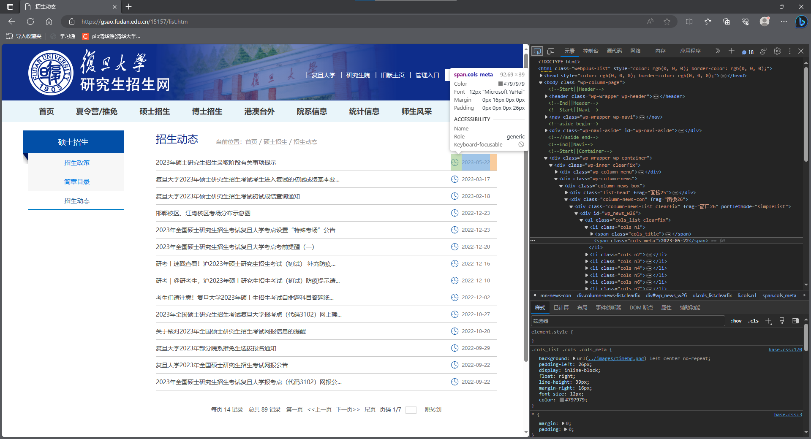
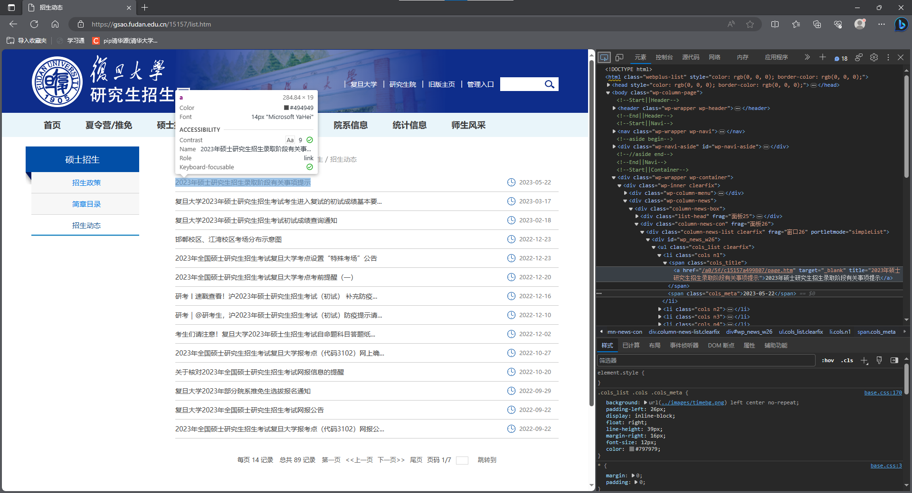
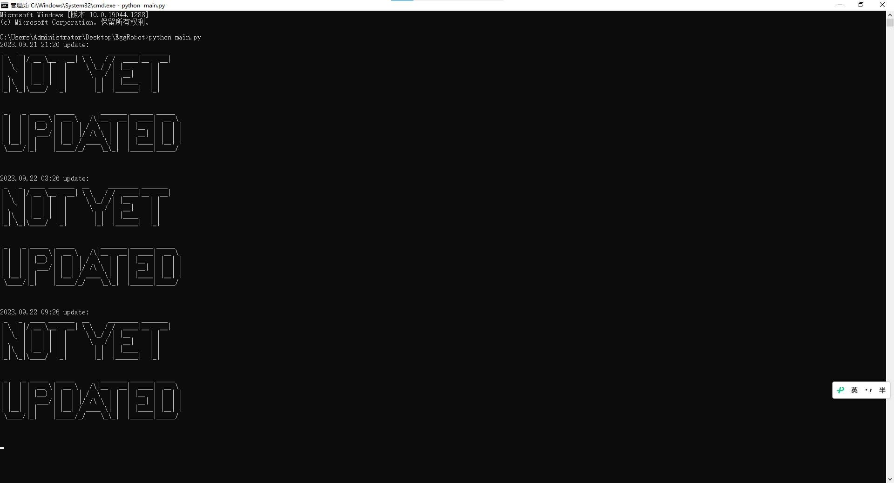

# 复旦官网研究生相关信息的小爬虫
---
**@Author：Adrian**

## 安装依赖

版本限制：

python < 3.11

安装依赖环境

```
pip install requirements -i https://pypi.tuna.tsinghua.edu.cn/simple
```
---

## config

| 变量名         | 描述                       |
| -------------- | -------------------------- |
| TARGET_DATE    | 目标日期，用于检查更新     |
| NO_UPDATE_TEXT | 没有更新时显示的文本       |
| MONITORED_URLS | 需要监测的网址列表         |
| URL_ALIAS      | 将网址映射到对应别名的字典 |
| SLEEP_TIME     | 监控间隔时间               |

### 如何获取相应的xpath地址？

按下`f12`进入开发者模式

找到对应的元素，查看对应的`xpath`地址





---
## 代码解析

代码包含以下主要函数：

###  `check_updates(url_alias)`

```
检查指定URL是否有更新的文档
:param url_alias: URL的别名及相关配置信息字典
:return: (是否有更新, 更新的文档列表)
```

### `process_url(url_key)` 

```
该函数用于处理URL，检查是否有更新并打印更新信息。它接收一个URL的别名及相关配置信息字典，并返回是否有更新的标志。
:param url_key: URL的别名及相关配置信息字典
:return: 是否有更新
```

### `print_large_text(text)` 
```
该函数用于打印大号文本艺术字。它接收一个待打印的文本，根据给定的字体生成相应的艺术字，并打印出来。
```


## 使用示例

```python
if __name__ == '__main__':
    main()
```
或者你可以选择在cmd里面运行
```
python main.py
<<<<<<< HEAD
```

## 效果展示



